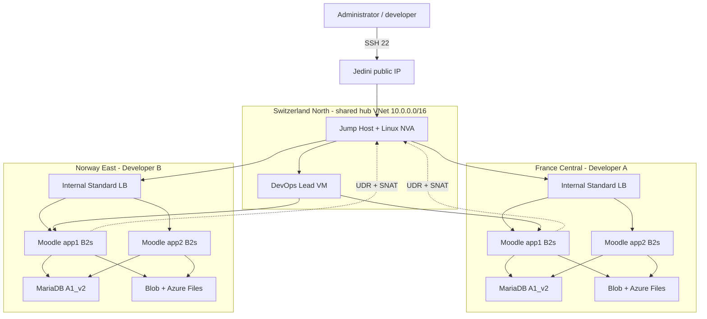
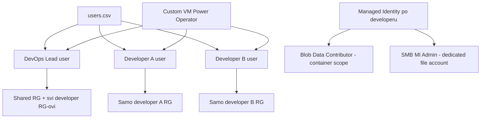

# Azure arhitektura i obrazlozenje elemenata

## Arhitekturni dijagram

Izmedu developer spoke VNetova nema peeringsa. Hub i spokeovi koriste Global VNet Peering jer su rasporedeni u tri regije radi Azure for Students kvote. Azure VNet peering nije tranzitivan, pa spoke A ne moze preko huba izravno dosegnuti spoke B. UDR za default route koristi Azure service chaining prema Jump/NVA privatnom IP-u u peered hubu; NVA firewall odbacuje forwarded pakete prema privatnim RFC1918 odredistima. Microsoft potvrduje da global peering i UDR prema virtualnom applianceu u peered VNetu podrzavaju ovaj model: [Virtual network peering overview](https://learn.microsoft.com/en-us/azure/virtual-network/virtual-network-peering-overview).

## Mrezne postavke

| Sloj | Adresni prostor | Svrha |
|---|---:|---|
| Hub VNet, Switzerland North | `10.0.0.0/16` | Jump/NVA i Lead VM |
| Jump subnet | `10.0.0.0/24` | Jedini NIC s javnim IP-om; IP forwarding |
| Lead subnet | `10.0.1.0/24` | Privatni Lead VM; egress preko Jump NVA |
| Developer 1 VNet, France Central | `10.20.0.0/16` | Izolirana okolina prvog developera |
| Developer 1 app subnet | `10.20.1.0/24` | Dva Moodle noda i interni LB |
| Developer 1 DB subnet | `10.20.2.0/24` | MariaDB VM |
| Developer 2 VNet, Norway East | `10.21.0.0/16` | Izolirana okolina drugog developera |

`defaultOutboundAccess: false` eksplicitno oznacava privatne subnete. App, DB i Lead subnet imaju `0.0.0.0/0 -> VirtualAppliance 10.0.0.4`. Jump VM ukljucuje Linux forwarding i MASQUERADE. Storage promet koristi `Microsoft.Storage` service endpoint i storage firewall pravilo za tocni app subnet, pa ne ide preko javnog Interneta.

Lead VM ima Internet egress kroz isti NVA te mrežni pristup svim developer okolinama. Za SSH autentikaciju koristi se agent forwarding s administratorskog računala (`ssh -A -J ...`), pa privatni SSH ključ nije kopiran ni zapisan na Lead VM.

## NSG i ASG model

- Jump NSG dopusta TCP/22 samo iz `AllowedSshCidr`, u pravilu trenutni javni `/32`.
- Lead NSG dopusta TCP/22 samo iz Jump subneta.
- App NSG dopusta SSH i HTTP samo iz hub VNet-a te health probe iz `AzureLoadBalancer` service taga.
- DB NSG dopusta TCP/3306 samo iz app ASG-a iste developer okoline te SSH iz huba.
- App i DB NIC-evi pripadaju razlicitim ASG-ovima; time pravila ne ovise o pojedinacnim VM IP adresama.
- Developer VNetovi nisu medusobno peered, a NVA odbacuje forwarded privatni promet.

## Load Balancer ili Application Gateway

| Kriterij | Standard Load Balancer | Application Gateway |
|---|---|---|
| OSI sloj | L4, TCP/UDP | L7, HTTP/HTTPS |
| Interni frontend | Da | Da |
| Health probe | TCP/HTTP/HTTPS | HTTP/HTTPS, napredniji |
| TLS termination | Ne | Da |
| Path/host routing | Ne | Da |
| WAF | Ne | Opcionalni WAF_v2 |
| Trosak i slozenost | Nizi | Znatno visi |
| Odabir za ovaj lab | Da | Ne |

Moodle treba raspodjelu HTTP prometa na dva jednaka backend VM-a, ali zadatak ne trazi WAF, TLS termination ni path routing. Interni Standard Load Balancer zato zadovoljava funkcionalni zahtjev uz znatno nizi trosak. Basic Load Balancer se ne koristi jer je umirovljen; Microsoft preporucuje Standard: [Azure Load Balancer overview](https://learn.microsoft.com/en-us/azure/load-balancer/load-balancer-overview).

## Tipovi VM-a i diskova

- Moodle app: `Standard_B2s`, tocno 2 vCPU i 4 GiB RAM-a kako zadatak zahtijeva.
- MariaDB: `Standard_A1_v2`, 1 vCPU i 2 GiB; odabrana je Av2 obitelj kako DB ne bi trosio ogranicenu B-series kvotu app VM-ova. Buduci da A-family podrzava samo Hyper-V Gen1, DB koristi Canonical Ubuntu 24.04 `server-gen1` sliku; app, Lead i Jump VM-ovi koriste Gen2 `server` sliku.
- Jump/NVA i Lead: `Standard_B1s`, jer ne izvrsavaju Moodle workload.
- Svaki app VM: OS disk 32 GiB Standard SSD LRS i zaseban data disk 32 GiB Standard SSD LRS.
- DB VM takoder ima odvojeni OS i data disk radi urednog smjestaja `/var/lib/mysql`.

Standard SSD je odabran umjesto Premium SSD-a jer testna okolina nema IOPS zahtjev koji opravdava veci trosak. U odnosu na Standard HDD daje predvidljiviju latenciju i prikladniji je za OS, aplikaciju i malu bazu.

Dva app VM-a su u jednom Availability Setu s dva fault domaina i pet update domaina. To simulira dostupnost web sloja. Jedan DB VM ostaje svjesno ogranicenje laboratorijske, ne produkcijske HA arhitekture.

## Objektna i datotecna pohrana

Svaki developer dobiva dva namjenska `StorageV2 Standard_LRS` accounta:

1. Blob account, container `moodlefiles`, montiran na oba app VM-a preko BlobFuse2.
2. File account, share `moodlebackup`, montiran na oba app VM-a preko SMB 3.x.

Oba accounta imaju javni endpoint s `defaultAction: Deny`; dopusten je samo tocni app subnet preko service endpointa. `allowSharedKeyAccess` je `false`.

Jedna user-assigned Managed Identity dijeli se izmedu dva app noda iste developer okoline:

- `Storage Blob Data Contributor` dodijeljen je na uski container scope;
- `Storage File Data SMB MI Admin` dodijeljen je na namjenski file account, koji sadrzi samo jedan share te okoline.

BlobFuse2 koristi `mode: msi` i client ID identiteta. Azure Files koristi SMBOAuth, `azfilesauthmanager`, Kerberos credential cache i automatski `azfilesrefresh`. Nema account keya ni SAS-a u VM konfiguraciji. Microsoft preporucuje sto uzi data scope za Blob RBAC: [Authorize blob access with Microsoft Entra ID](https://learn.microsoft.com/en-us/azure/storage/blobs/authorize-access-azure-active-directory).

## RBAC dijagram

Custom rola `TechSprint VM Power Operator` sadrzi samo VM read, instanceView read, start, deallocate, powerOff i restart akcije te minimalni Resource Group read. Postojeci developer korisnik dobiva rolu samo na svojoj Resource Grupi. Postojeci Lead korisnik dobiva istu rolu na shared RG-u i svim developer RG-ovima. Izravni user assignment koristi se jer fakultetski tenant ne dopusta upravljanje Entra grupama. Nema Contributor ili Owner role za testne korisnike.

## Resource Group hijerarhija

Azure Resource Grupe se ne mogu ugnijezditi. Logicka hijerarhija postize se imenima i scopeovima:

- `rg-techsprint-tst-shared-swi`
- `rg-techsprint-tst-dev01-swi`
- `rg-techsprint-tst-dev02-swi`

RBAC scope tocno prati ovu podjelu.

## Konvencija imenovanja

Opci oblik je `<tip>-techsprint-tst-<uloga ili vlasnik>-<regija>`.

| Tip | Primjer |
|---|---|
| Resource Group | `rg-techsprint-tst-dev01-swi` |
| VNet | `vnet-techsprint-tst-luka-lukic` |
| Subnet | `snet-app`, `snet-db` |
| VM | `vm-techsprint-tst-luka-lukic-app1` |
| Disk | `disk-techsprint-tst-luka-lukic-app1-data` |
| NSG / ASG | `nsg-techsprint-tst-luka-lukic-app`, `asg-...` |
| Load Balancer | `lb-techsprint-tst-luka-lukic-int` |
| Public IP | `pip-techsprint-tst-jump-abc23` |
| Storage | `stlukalukicabc23obj`, `stlukalukicabc23file` |

Storage nazivi su posebni jer moraju biti globalno jedinstveni, imati 3-24 znaka i sadrzavati samo mala slova i brojeve. Sufiks se generira jednom i cuva lokalno radi idempotentnosti.

## Tagovi

Svaki resurs koji podrzava tagove dobiva:

| Tag | Vrijednost |
|---|---|
| `project` | `techsprint` |
| `environment` | `testing` |

Dodaju se i `owner` ili `role` gdje je primjenjivo. Role assignments, subneti, peerinzi, blob containeri i file shareovi ne podrzavaju Azure tagove kao samostalni child/extension resursi; to nije propust IaC-a.

## Azure - OpenStack mapiranje za kasniju usporedbu

| Funkcija | Azure | OpenStack |
|---|---|---|
| VM | Azure Virtual Machines | Nova |
| Image | Marketplace/Compute Gallery image | Glance image |
| VNet/subnet | VNet / subnet | Neutron network / subnet |
| NSG | Network Security Group + ASG | Neutron security group |
| Load balancer | Standard Load Balancer | Octavia LBaaS |
| Block disk | Managed Disk | Cinder volume |
| Object storage | Blob Storage | Swift |
| File storage | Azure Files | Manila share |
| IAM/RBAC | Microsoft Entra ID + Azure RBAC | Keystone users/projects/roles |
| Resource isolation | Resource Group + VNet + RBAC | Project/tenant + network |
| IaC | Bicep/ARM | Terraform/Ansible/Heat |
